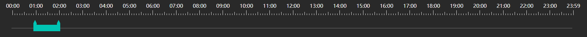

# lm-scale-time

> A Vue.js project

## Build Setup

``` bash
# install dependencies
1 npm install lm-scale-time --save

2 main.js 中

 import lmScaleTime from 'lm-scale-time'
 Vue.use(lmScaleTime);

 <lm-scale-time @dragTime></lm-scale-time>

1.0.0版无需传递任何参数。接受值@dragTime


